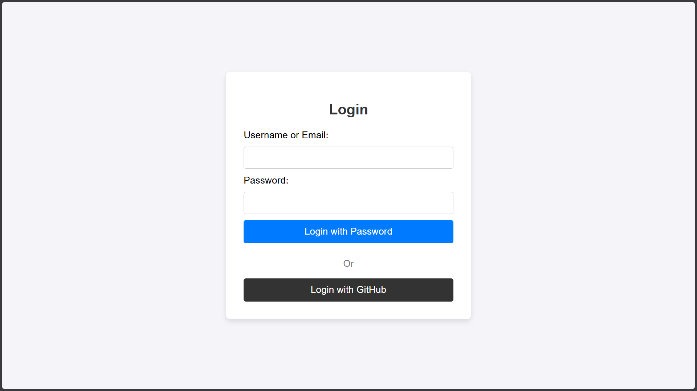
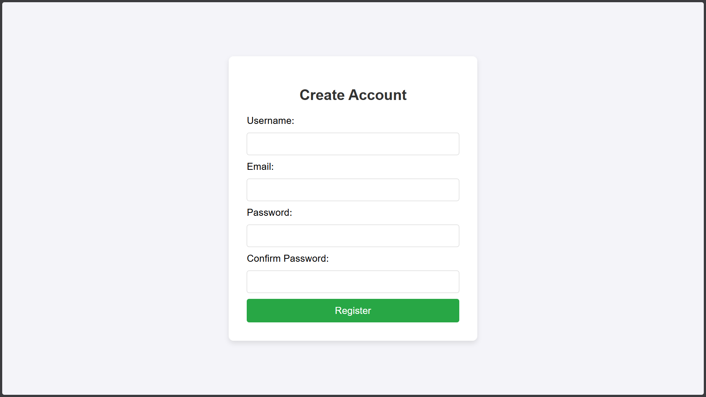
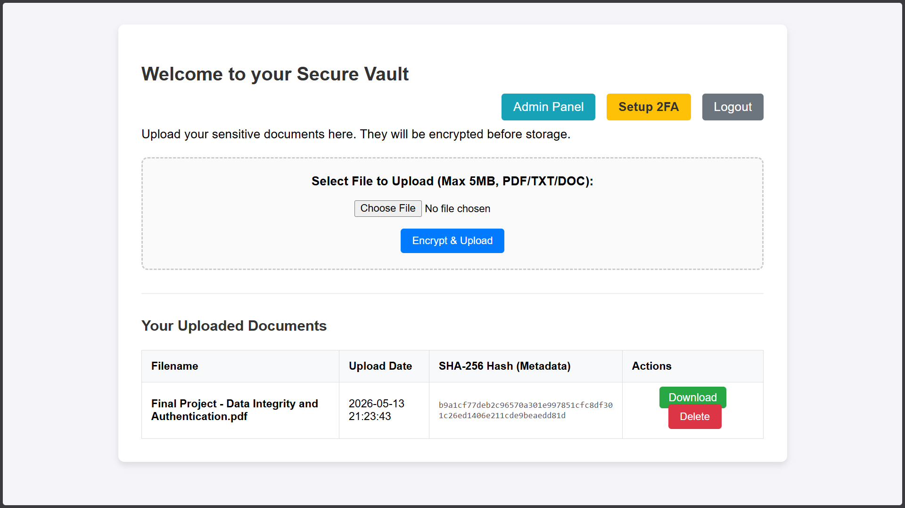
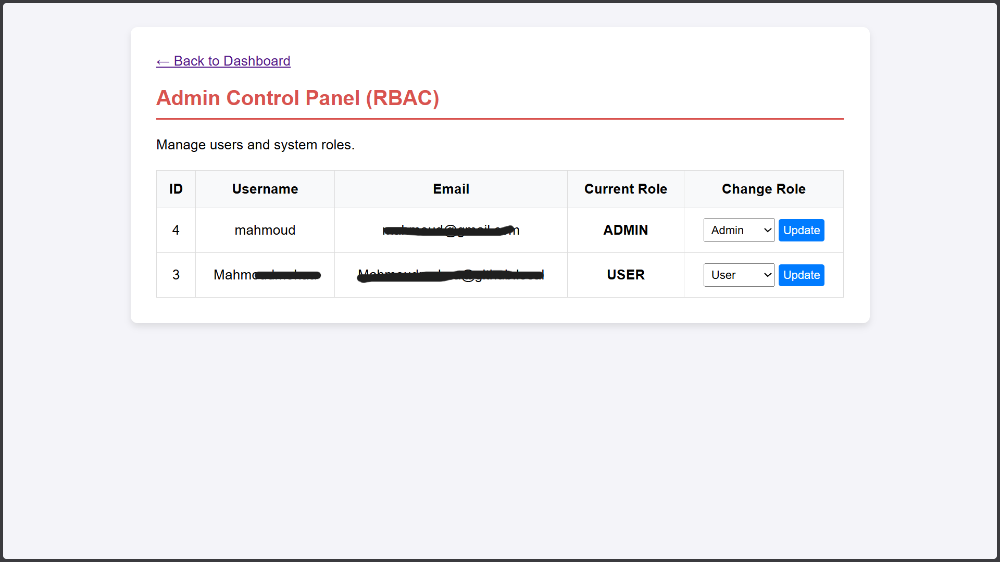
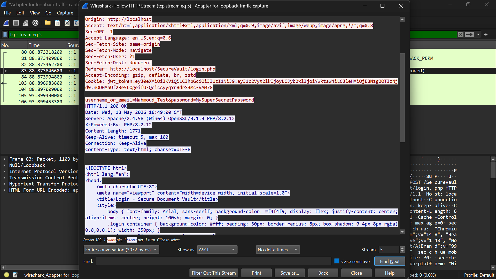
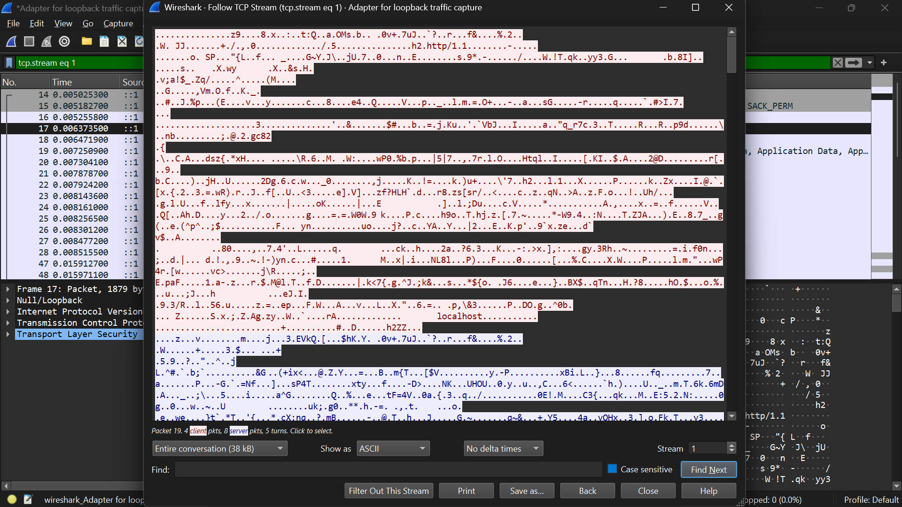
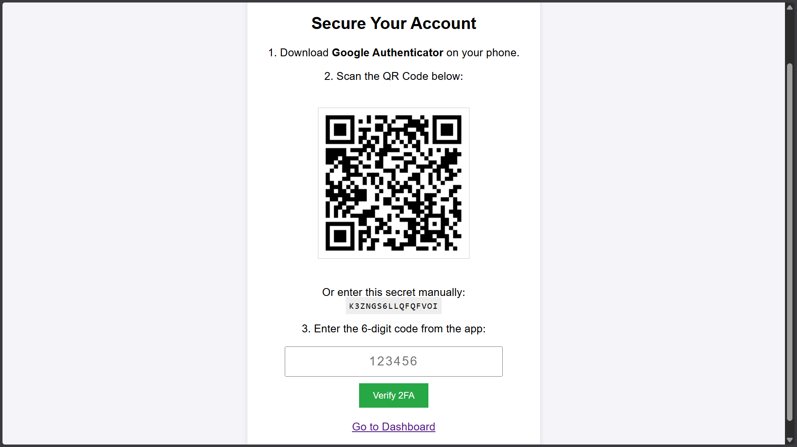

# 🛡️ SecureVault - Secure Document Vault System

## 📖 Project Overview

**SecureVault** is a secure web-based document management system designed to protect sensitive digital files using modern cybersecurity techniques and enterprise-level security concepts.

The system allows users to securely upload, manage, encrypt, verify, and protect documents while implementing multiple layers of authentication, authorization, encryption, integrity verification, and secure communication.

---

# ✨ Security Features

## 🔐 Authentication & User Management

### Secure Registration & Login

- User registration and login system
- Password confirmation validation
- Secure password policy enforcement:
  - Minimum 8 characters
  - Uppercase letter
  - Lowercase letter
  - Number
  - Special character

### Password Hashing

Passwords are securely hashed using:

- bcrypt
- password_hash()
- password_verify()

---

## 🔑 JWT Authentication

The project implements custom JWT-based authentication using:

- Header
- Payload
- HMAC SHA-256 Signature

JWT tokens are securely stored inside **HttpOnly Cookies** to reduce XSS risks.

### JWT Payload Includes

- User ID
- User Role
- Expiration Time

---

## 🌐 OAuth Login with GitHub

Users can authenticate using their GitHub accounts through OAuth 2.0 integration.

### OAuth Flow

1. Redirect user to GitHub
2. Exchange authorization code for access token
3. Retrieve GitHub user data
4. Automatically create account if user does not exist
5. Generate JWT session

---

## 📱 Two-Factor Authentication (2FA)

The system includes a custom implementation of TOTP-based 2FA compatible with:

- Google Authenticator

### Features

- QR Code generation
- Base32 secret generation
- Time-based OTP verification
- RFC 6238 implementation

---

# 🛡️ Role-Based Access Control (RBAC)

The system supports multiple authorization levels:

| Role    | Permissions                          |
| ------- | ------------------------------------ |
| Admin   | Manage users and permissions         |
| Manager | Review and verify documents          |
| User    | Upload and manage personal documents |

---

# 🔒 Secure Document Protection

## AES Encryption

Uploaded files are encrypted before storage using secure cryptographic techniques such as AES-256 encryption.

## SHA-256 Integrity Verification

Each uploaded document generates:

- SHA-256 hash
- Integrity verification mechanism

This ensures files are not modified after upload.

---

# 🌍 HTTPS & Secure Communication

The application supports HTTPS secure communication to protect transmitted data against:

- Packet sniffing
- MITM attacks
- Credential interception

---

# 🕵️ Wireshark MITM Demonstration

The project includes a security demonstration using Wireshark to compare:

## Before HTTPS

- Sensitive data visible in plain text

## After HTTPS

- Encrypted TLS traffic
- Protected payload transmission

---

# 💻 Technology Stack

## Backend

- PHP (Vanilla PHP)
- Object-Oriented Programming (OOP)

## Frontend

- HTML5
- CSS3
- JavaScript

## Database

- MySQL
- PDO Prepared Statements

## Security Technologies

- JWT Authentication
- OAuth 2.0
- bcrypt
- AES Encryption
- SHA-256
- HMAC-SHA256
- TOTP 2FA

---

# ⚙️ Installation & Setup

## 1. Clone Repository

```bash
git clone https://github.com/Mahmoudmohaa/Secure-Document-Vault.git
```

> Replace the link above with your GitHub repository link.

---

## 2. Move Project

Move the project folder into your web server directory.

### XAMPP

```bash
htdocs/
```

---

## 3. Create Database

Create a database named:

```sql
secure_vault_db
```

Then import:

```sql
secure_vault_db.sql
```

---

## 4. Configure Database & Security Keys

Manually configure your database credentials and security secrets inside the project files:

- includes/db.php
- login.php
- dashboard.php
- oauth_callback.php

---

## 5. Run Project

Open:

```bash
http://localhost/SecureVault/login.php
```

---

# 📸 Screenshots

## Login Page



---

## Registration Page



---

## Dashboard



---

## Admin Panel



---

## Wireshark HTTP Capture



---

## Wireshark HTTPS Capture



---

## 📱 Two-Factor Authentication Setup



_Google Authenticator integration using TOTP-based verification._

---

# 📂 Project Structure

```bash
SecureVault/
│
├── includes/
├── uploads/
├── screenshots/
├── login.php
├── register.php
├── oauth_callback.php
├── setup_2fa.php
├── dashboard.php
├── secure_vault_db.sql
├── .env
└── README.md
```

---

# 🎯 Project Objectives

This project demonstrates practical implementation of:

- Authentication
- Authorization
- Encryption
- Integrity Verification
- Secure Communication
- Secure Coding Practices

---

# 🚀 Future Improvements

- Email verification system
- Secure password reset
- Audit logging system
- File sharing permissions
- Advanced admin analytics
- Docker deployment

---

# 👨‍💻 Author

**Mahmoud Mohamed Gomaa**  
Third-Year Computer Science Student  
Cybersecurity Specialization

---

# 📜 License

This project was developed for educational purposes only.
